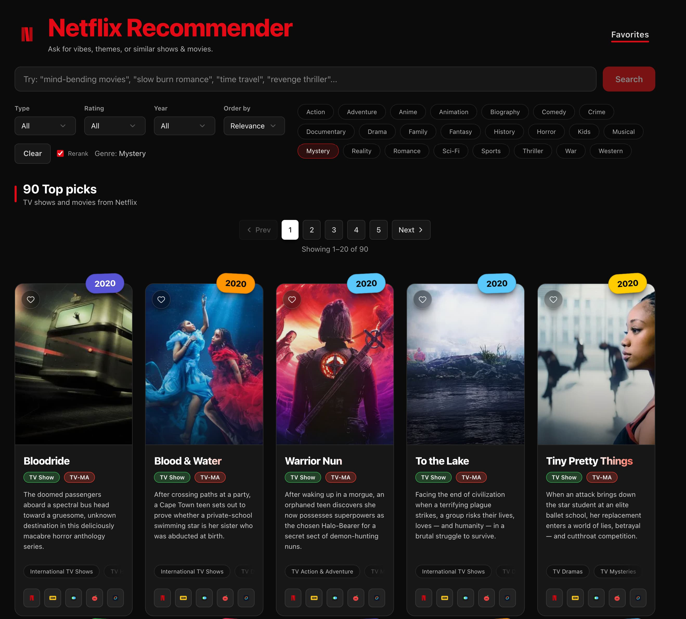
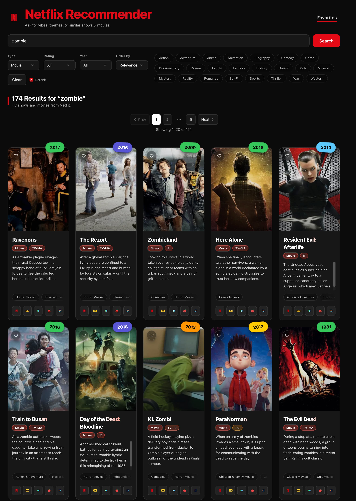
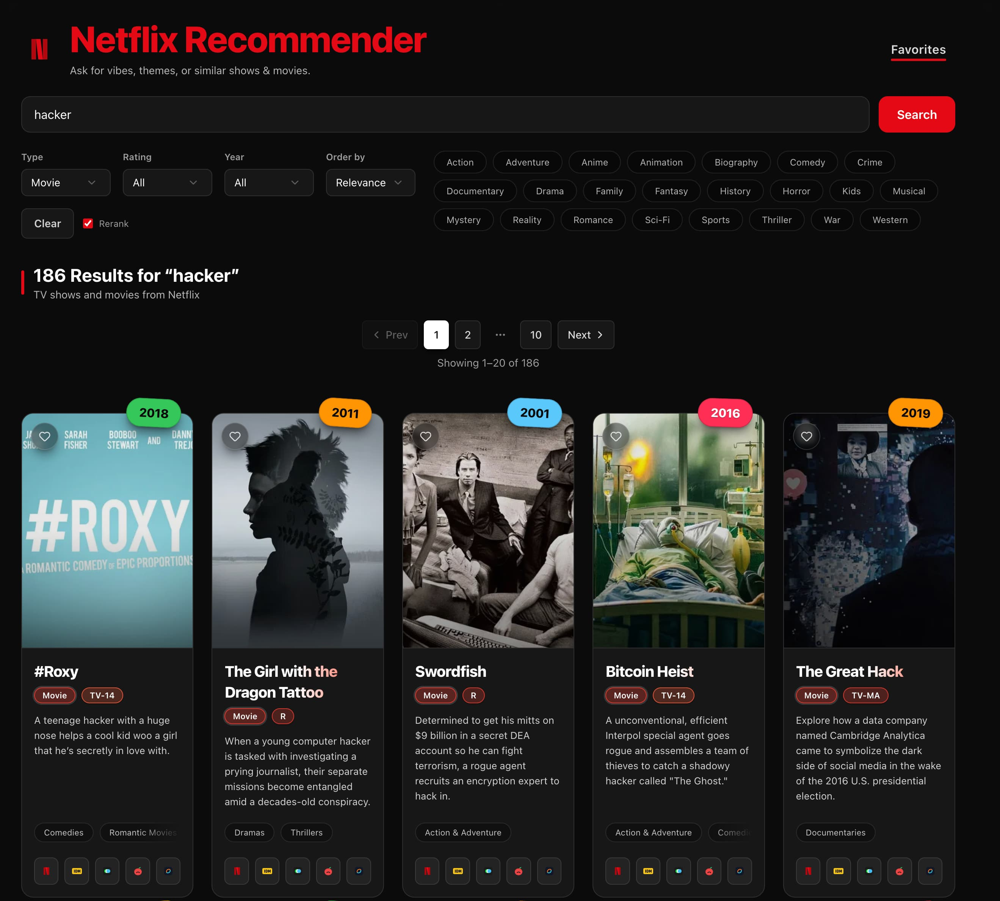

# Netflix Recommender using Modelence Cloud

**What it is**

- A Netflix-style semantic recommender like [/r/kdramarecommends](https://www.reddit.com/r/kdramarecommends/) for movies + TV shows from `netflix.csv` (dataset through ~2021).
- Type a vibe (for example _"mind-bending"_, _"slow burn"_, _"revenge thriller"_) and get a ranked, filterable grid.
- Built as a [Modelence](https://modelence.com/) App using Modelence App Builder (React + Tailwind frontend with [Bun](https://bun.com/) as a package manager, Modelence backend + MongoDB stores) for [Modelence Hackathon.](https://modelence.com/hackathon)

**Screenshots**

- Main UI



- Zombie movies



- Hacker movies



**Links**

- Dataset (Kaggle): https://www.kaggle.com/datasets/imtkaggleteam/netflix
- Voyage AI: https://voyageai.com/
- Voyage dashboard (keys/usage): https://dashboard.voyageai.com/
- Modelence Voyage AI guide (reference): https://docs.modelence.com/voyage-ai
- Modelence docs: https://docs.modelence.com/
- TMDB API docs: https://developer.themoviedb.org/

**Key Features**

- Semantic search: embeddings + vector search, with optional Voyage rerank for tighter ordering (the `Rerank` toggle).
- Browse mode: fast pagination + filters without doing vector search.
- Filters + sorting: type, rating, year, genre, relevance/year/title sorts.
- URL query param sync: `q`, `page`, `pageSize`, `type`, `rating`, `year`, `genre`, `sort`, `rerank`.
- Clickable tags: type badge toggles the `type` filter and genre pills toggle the `genre` filter.
- Favorites: heart button on each card, stored in MongoDB (`netflix_favorites`) keyed by user when logged in, otherwise keyed by the current session.
- Favorites route: `/favorites` shows your saved list with pagination.
- TMDB thumbnails: lazy-loaded near viewport with controlled concurrency and cached in MongoDB (`netflix_posters.thumb_url` / `poster_url`) to avoid re-fetching.
- External links row: Netflix, IMDb, Letterboxd, Rotten Tomatoes, JustWatch.

**Data + Storage**

- Stores (MongoDB via Modelence):
- `netflix_titles`: title metadata + embeddings (embeddings never sent to the client).
- `netflix_posters`: TMDB cache (poster/thumb URLs + cooldown/backoff state).
- `netflix_meta`: index + filters metadata.
- `netflix_favorites`: per-user/per-session favorites.
- Seeding strategy (idempotent):
- Prefer `data/` local index assets if present (no external embedding calls).
- Fallback to embedding `netflix.csv` with Voyage only if the local index assets are missing.
- On start, if the DB has fewer titles than the local index, missing titles are inserted.

**How Search Works**

- Browse (empty query): MongoDB match/sort/skip/limit with projection excluding `embedding`.
- Semantic search (non-empty query):
- Optional query rewrite (if `OPENROUTER_API_KEY` is set).
- Embed query with Voyage (`voyage-4-lite`).
- Vector search in MongoDB.
- Filter + lexical boost.
- Optional rerank (if `rerank=1`) with Voyage (`rerank-2.5-lite`) on the top slice.

**What the Rerank Toggle Does**

- When `Rerank` is enabled, the backend makes an additional Voyage rerank call to reorder the top results (better “vibe” ordering, slightly higher latency/cost).
- When `Rerank` is disabled, results are ordered by vector similarity + boosts only (faster, fewer API calls).

**TMDB Rate-Limit Hygiene (Free Plan Friendly)**

- Server-side limiter: low concurrency + minimum delay per request.
- Client-side limiter: queues poster method calls to avoid request storms.
- Backoff/cooldown:
- On TMDB `429` or `5xx`, the server enters a short cooldown.
- Errors are cached with exponential backoff so the app does not spam TMDB.

**Run Locally**

- Install deps + run dev server:

```bash
cd modelence
bun install
bun run dev
```

- Open the URL printed by the dev server (default: `http://localhost:3000`).

**App Routes**

- `/` - search + browse grid (URL params control state).
- `/favorites` - your saved favorites (per-user or per-session).

**Backend Methods (Modelence)**

- `netflix.status` - seed/index status (client uses this to gate other calls).
- `netflix.filters` - filter option lists (cached in `netflix_meta`).
- `netflix.search` - paginated browse or semantic search, always excludes embeddings.
- `netflix.poster` - TMDB thumbnail lookup (cached in `netflix_posters`).
- `netflix.favorites` - list favorites (joined to `netflix_titles`).
- `netflix.toggleFavorite` - toggle favorite by `show_id`.

**Environment Examples**

- Local app secrets and API keys:
- `.env.example` (contains links in comments for where to get keys)

```bash
# Required
MONGODB_URI=mongodb+srv://...

# Voyage
VOYAGE_API_KEY=...

# Optional
OPENROUTER_API_KEY=...
TMDB_API_KEY=...
```

- Optional Modelence Cloud sync:
- `.modelence.env.example` (contains links in comments)

```bash
MODELENCE_SERVICE_ENDPOINT=https://cloud.modelence.com
MODELENCE_SERVICE_TOKEN=...
MODELENCE_CONTAINER_ID=...
MODELENCE_ENVIRONMENT_ID=...
```

**Typecheck, Lint, Tests**

```bash
bun run typecheck
bun run lint
bun test
```

**Debugging Request Storms (Dev Only)**

- Request counters:
- `GET /api/debug/requests?windowMs=300000`
- `POST /api/debug/requests/reset`

**Example Queries**

- _"mindfuck"_
- _"time travel"_
- _"zombie apocalypse"_
- _"heist"_
- _"stand up comedy"_
- _"cooking show"_

**How This Repo Started (AI Prompt Log)**

- This app began as a Modelence app-builder scaffold generated from a quick voice-to-text ramble.
- The prompt was dictated as a ramble into Claude (Sonnet 4.5), then handed to the Modelence app-builder to generate the first MVP in ~2-3 prompts.
- After that, the code was edited locally to add the Kaggle `netflix.csv` dataset and semantic search using Voyage AI (guided by the Modelence Voyage AI example/docs).
- The first prompt (verbatim):

```text
Create a web app for searching movies and TV shows with this structure:

**UI Requirements:**
- Dark theme (black/dark gray background, white/red accents)
- Single search bar with placeholder: "Try: 'mind-bending', 'slow burn', 'revenge'..."
- Red "Search" button next to search bar
- Filter dropdowns: Type, Rating, Year, Order by (with Clear button)
- Clickable genre pill tags below filters
- Results grid: 5 cards per row with generous spacing
- Pagination controls (Prev/Next + page numbers)
- Result count header: "X Results for 'query'"

**Card Design:**
- Year badge (colored, top-right corner)
- Blurred background thumbnail image
- Title (bold, large)
- Type badge + Rating badge (e.g., "Movie", "R")
- 2-3 line description
- Genre tags at bottom
- Row of 5 icon buttons at bottom (for external links with tooltips)

**Tech Stack:**
- Frontend: React + Tailwind CSS
- Backend: Bun server with REST API

**Features:**
- Search functionality
- Filter by type/rating/year/genre
- Sort by relevance/year/title
- Pagination (20 results per page)
- External search links (Netflix, IMDb, Letterboxd, Rotten Tomatoes, JustWatch)

**API Endpoints:**
- GET /api/picks - initial grid
- GET /api/search?q=...&page=1&type=...&rating=... - search with filters
```

**Prompting Tips (ASCII-Only, Better Second Pass)**

- Keep the goal in one sentence.
- Put non-negotiables in an explicit checklist.
- Describe your “data truth” (what lives in DB vs client).
- Add rate-limit constraints as numbers.
- Include 5-10 acceptance checks.

```text
GOAL: Netflix-style semantic recommender with Modelence stores.

MUST:
- Client never downloads embeddings.
- Pagination fetches only one page.
- TMDB: max 2 concurrency, min 250ms delay, cache in DB.
- URL params are source of truth.

ACCEPTANCE:
- Search "mindfuck" returns Inception/ARQ/Black Mirror near top.
- Pagination changes trigger exactly 1 search request.
- Favorites persist after refresh.
```
